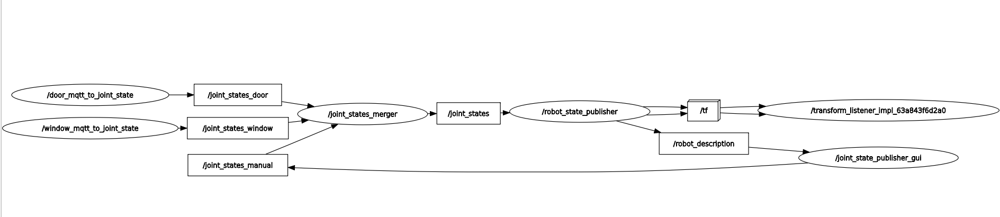

# Yimin_Dochub
This repo provides the ros2 scripts that were used to spawn and control a robot at wbk ct-cell. 


### Requirements
- Ubuntu 22.04
- ros2-humble Reference: [ros2 humble ubuntu installation](https://docs.ros.org/en/humble/Installation/Ubuntu-Install-Debs.html)
- A workspace(e.g. ~/ifl_test_ws/)

## How to use?
- So far I am doing everything in a rather clumsy way. Later everything would be done in a docker container.
- Installation of environment and tools
``` bash
$ sudo apt install terminator
$ sudo apt install build-essentials gcc make perl dkms git
$ sudo apt install gedit
$ sudo snap install code --classic
$ sudo apt install ros-humble-urdf-tutorial
$ sudo apt install ros-humble-tf2-tools
$ sudo apt install ros-humble-ros-gazebo

$ source /opt/ros/humble/setup.bash
```
- Installation of useful extensions in VSCode
    - Robot Developer Extensions for ROS2
    - CMake

``` bash
# To build the pipeline between mqtt broker and ros nodes, a python package called "paho-mqtt" should be installed during the installation
$ sudo apt install python3-pip
$ pip install paho-mqtt
```

- Add ROS2 and colcon autocomplete to .bashrc
``` bash
$ cd
$ gedit .bashrc

# Add the following line to the end of this file
$ source /opt/ros/humble/setup.bash
$ source /usr/share/colcon_argcomplete/hook/colcon-argcomplete.bash
# Save and exit

$ source .bashrc
```

- Test whether the environment of ros2 is correctly set up
    - Type "ros2" and press twice "TAB"
    - If possible options appear, the setup is done.


- Clone this repo under the workspace folder
``` bash
$ cd ifl_test_ws
$ git clone https://github.com/SFB-Circular-Factory-WG-C/Yimin_Dochub.git

# official repo for UR robots and some other repos from IFL
$ cd ifl_test_ws/src
$ git clone https://github.com/UniversalRobots/Universal_Robots_ROS2_Description.git
$ git clone https://gitlab.kit.edu/kit/ifl/gruppen/air/ros2/ros2_robotiq_gripper.git
```

- **NOTE** that information that is now written in the node script is only for test purpose. It should be modified according to the real setup at wbk.
```
mqtt_host: 172.23.253.37
mqtt_port: 1884
username: user1
password: crc1574
topic for the door: esp32-door-distance-ct-cell/sensor/vl53l0x_distance/distance
topic for the window: (?)
```

- Build and source all these packages
``` bash
$ cd ifl_test_ws/
$ sudo rosdep init
$ rosdep update
$ rosdep install --ignore-src --from-paths src -y

$ colcon build
# ^^^^^^^^^^^^ ideal
# vvvvvvvvvvvv For now use the following lines
$ colcon build --packages-select ur_description robotiq_description robot_station_description robot_station_mqtt 
$ source install/setup.bash
```

- Now we can run the following command to display the UR Robot in the CT cell environment
``` bash
$ ros2 launch robot_station_description view.launch.py
```

### How it works?

- The movement of joints in Rviz depends on the data from the topic /joint_states
- Data from the MQTT broker is converted to translation data to the corresponding joint before being published to the topic /joint_states_door and /joint_states_window
- Another node called "joint_state_merger" will merge the data from these topics and publish the combined data together with joint states of the UR robot to /joint_states
- A demo video can be found in /Resources/demo1.mp4
### What to do next?
1. Modify the node scripts so that they are fully compatible with the real setup at wbk
1. Add moveit setup
1. Add collision zone


