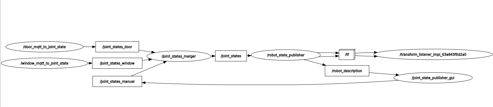

# Yimin_Dochub
This repo provides the ros2 scripts that were used to spawn and control a robot at wbk ct-cell. 


## Requirements
- Ubuntu 22.04
- ros2-humble Reference: [ros2 humble ubuntu installation](https://docs.ros.org/en/humble/Installation/Ubuntu-Install-Debs.html)
- A workspace(e.g. ~/ifl_test_ws/)

## Hardware Setup
- A mobile station for the robot
- Universal Robots UR10e (with URCap installed)
- Robotiq Gripper 2F-140
- Orbbec Mega

## How to use?
- So far I am doing everything in a rather clumsy way. Later everything would be done in a docker container.
- Installation of environment and tools
``` bash
$ sudo apt install terminator
$ sudo apt install build-essentials gcc make perl dkms git
$ sudo apt install gedit
$ sudo snap install code --classic
$ sudo apt install ros-humble-urdf-tutorial
$ sudo apt install ros-humble-tf2-tools
$ sudo apt install ros-humble-ros-gazebo
$ sudo apt install ros-humble-ros2-control ros-humble-ros2-controllers
$ sudo apt install ros-humble-rmw-cyclonedds-cpp
$ sudo apt install ros-humble-moveit

$ source /opt/ros/humble/setup.bash
```
- Installation of useful extensions in VSCode
    - Robot Developer Extensions for ROS2
    - CMake

``` bash
# To build the pipeline between mqtt broker and ros nodes, a python package called "paho-mqtt" should be installed during the installation
$ sudo apt install python3-pip
$ pip install paho-mqtt
```

- Add ROS2 and colcon autocomplete to .bashrc
``` bash
$ cd
$ gedit .bashrc

# Add the following line to the end of this file
export RMW_IMPLEMENTATION=rmw_cyclonedds_cpp

source /opt/ros/humble/setup.bash
source /usr/share/colcon_argcomplete/hook/colcon-argcomplete.bash
# Save and exit

$ source .bashrc
```

- Test whether the environment of ros2 is correctly set up
    - Type "ros2" and press twice "TAB"
    - If possible options appear, the setup is done.


- Clone this repo under the workspace folder
``` bash
$ cd ifl_test_ws
$ git clone https://github.com/SFB-Circular-Factory-WG-C/Yimin_Dochub.git

# official repo for UR robots and some other repos from IFL
$ cd ifl_test_ws/src
$ git clone -b humble https://github.com/UniversalRobots/Universal_Robots_ROS2_Description.git
$ git clone -b humble https://github.com/UniversalRobots/Universal_Robots_ROS2_Driver.git
$ git clone https://github.com/UniversalRobots/Universal_Robots_Client_Library.git
$ git clone -b ros2 https://github.com/tylerjw/serial.git
$ git clone git@gitlab.kit.edu:kit/ifl/gruppen/air/ros2/arm_api2.git
$ git clone git@gitlab.kit.edu:kit/ifl/gruppen/air/ros2/arm_api2_py.git
$ git clone git@gitlab.kit.edu:kit/ifl/gruppen/air/ros2/arm_api2_msgs.git
$ git clone git@gitlab.kit.edu:kit/ifl/gruppen/air/ros2/robotiq_2f_urcap_adapter.git
$ git clone https://gitlab.kit.edu/kit/ifl/gruppen/air/ros2/ros2_robotiq_gripper.git
```

- **NOTE** Information to mqtt broker and relevant topics
```
mqtt_host: 172.23.253.37
mqtt_port: 1884
username: user1
password: (Please contact me)
topic for the door: esp32-door-distance-ct-cell/sensor/vl53l0x_distance/state
topic for the window: esp32-window-ct/select/status/state
```

- Build and source all these packages
``` bash
$ cd ifl_test_ws/
$ sudo rosdep init
$ rosdep update
$ rosdep install --ignore-src --from-paths src -y

$ colcon build
$ source install/setup.bash
```

- Run the following command to display the UR Robot in the CT cell environment
``` bash
$ ros2 launch robot_station_description view.launch.py
```

- To interact with the robot in Moveit, run the following commands
```bash
$ ros2 launch robot_station_bringup robot_station_mqtt.launch.py
$ ros2 launch robot_station_bringup robot_station.launch.py
$ ros2 launch robot_station_bringup robot_station_moveit.launch.py
```

## How it works?

- The movement of joints in Rviz depends on the data from the topic /joint_states
- Data from the MQTT broker is converted to translation data to the corresponding joint before being published to the topic /joint_states_door and /joint_states_window
- Another node called "joint_state_merger" will merge the data from these topics and publish the combined data together with joint states of the UR robot to /joint_states
- A demo video can be found in /Resources/demo1.mp4


## Problems so far
1. Although the door and the window can move according to their state from the MQTT broker, their models (visual or collison?) will leave a "shadow" in their previous position in RViz, which may cause trajectory planning failure.
1. Even if the "shadow" problem is solved, the collision model of the ct machine is still a cube (solid, not hollow), which leads to the same problem as above.
1. When I set the pose of the gripper from "open" to "closed" in Moveit, the robotiq_2f_140_adapter_node will raise an error saying "Failed to convert goal values into normalized values for the gripper: Provided effort in newton exceeds limits of the gripper.Validate that the provided force in within the specs of the gripper!
" (from robotiq_2f_140_adapter_node.py line 315-317), indicating that the "max_effort" has exceeded the limit 10-125N. But I don't know where I set this value in Moveit or in script.

## What to do next?
1. Solve the problem for the gripper adapter node.
1. Check whether the "shadow" is collision or just visual element.
1. Configure the Orbbec Mega camera.


