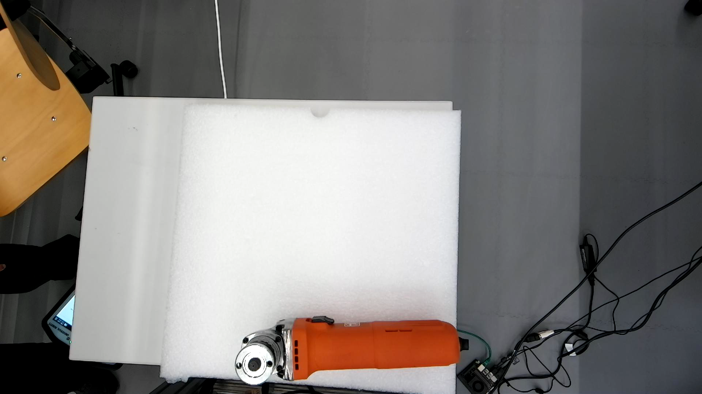
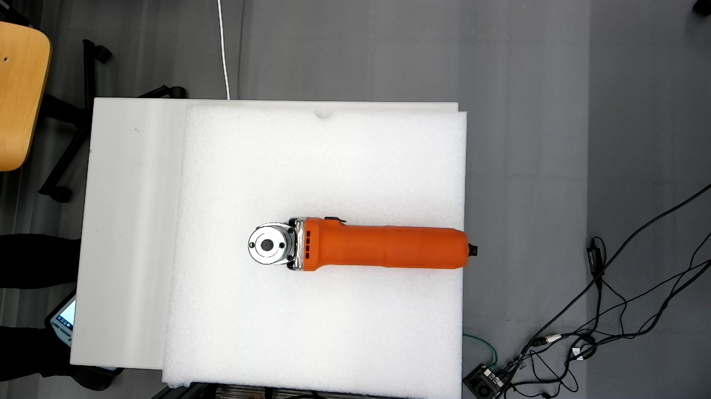
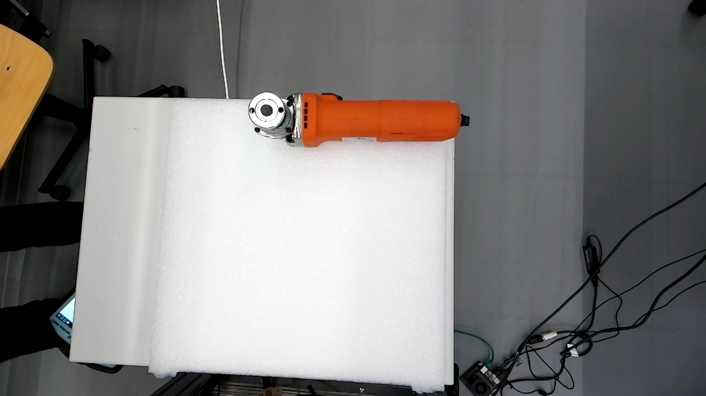
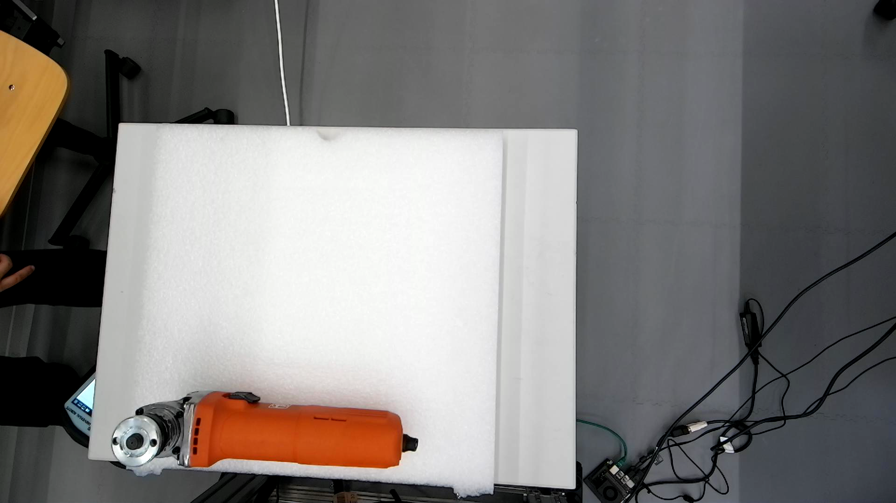
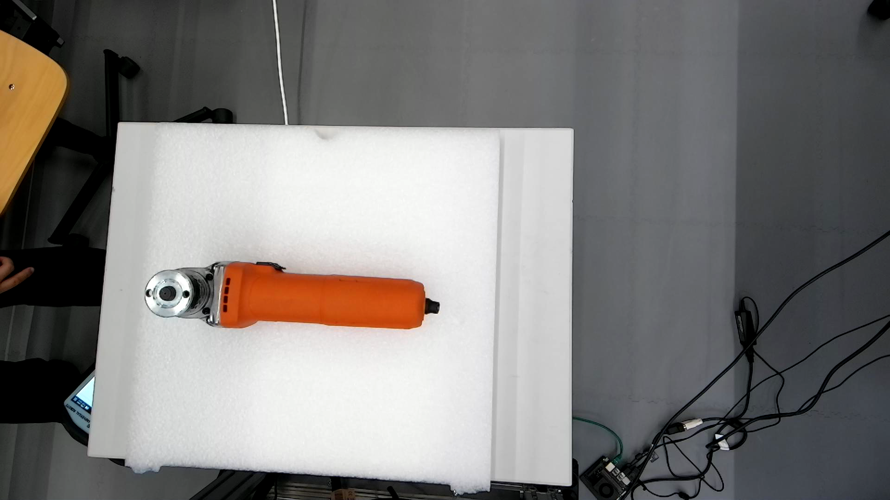
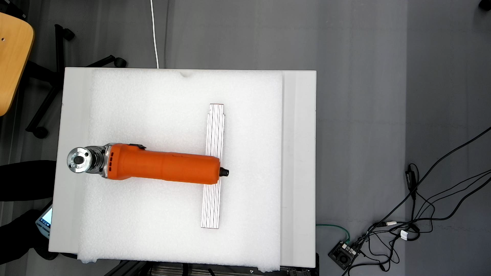
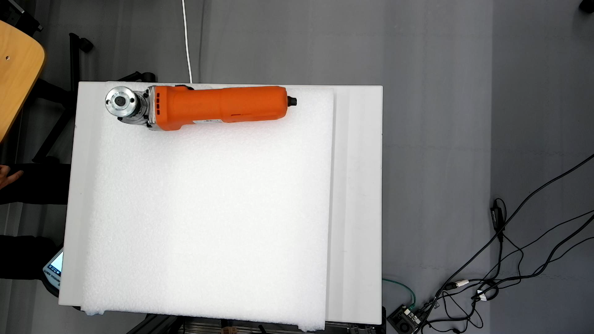
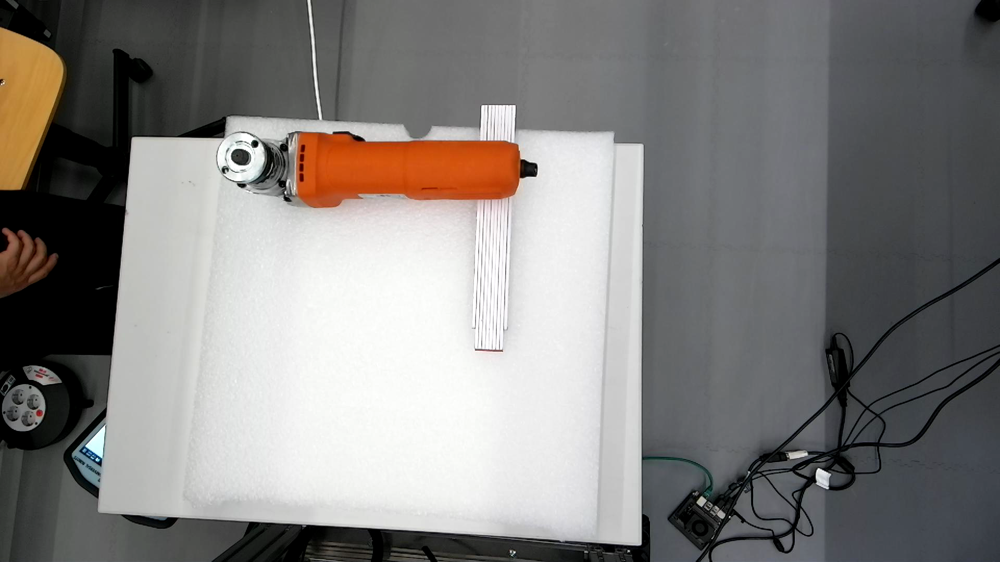

# Experiments 2026.05.08
## Test 1

|No.|Result|Description|Poses|Grasp|Log|Record|
|--|--|--|--|--|--|--|
|1|Failed|No poses generated|[1-1](1-1_no_pose.gif)|
|2|Failed|No poses generated|
||Skipped|
- Conclusion: Test1 stopped after 2 attempts due to no possible grasp poses

## Test 2

|No.|Result|Description|Poses|Grasp|Log|Record|
|--|--|--|--|--|--|--|
|1|Failed|No poses generated|[2-1](2-1_no_pose.gif)|
|2|Failed|No poses generated|
||Skipped|
- Conclusion: Test2 stopped after 2 attempts due to no possible grasp poses

## Test 3

|No.|Result|Description|Poses|Grasp|Log|Record|
|--|--|--|--|--|--|--|
|1|Failed|Grasp aborted due to potential collision|[3-1](3-1_poses.gif)|[3-1](3-1_grasp.gif)||[3-1](3-1.mp4)|
|2|Failed|Grasp aborted due to potential collision|[3-2](3-2_poses.gif)|[3-2](3-2_grasp.gif)||[3-2](3-2.mp4)|
||Skipped|
- Conclusion: Test3 stopped after 2 attempts due to potential link collisions

## Test 4

|No.|Result|Description|Poses|Grasp|Log|Record|
|--|--|--|--|--|--|--|
|1|Failed|No poses generated|[4-1](4-1_no_pose.gif)|
|2|Failed|No poses generated|
||Skipped|
- Conclusion: Test4 stopped after 2 attempts due to no possible grasp poses

## Test 5

|No.|Result|Description|Poses|Grasp|Log|Record|
|--|--|--|--|--|--|--|
|1|Failed|No poses generated|[5-1](5-1_no_pose.gif)|
|2|Failed|No poses generated|
||Skipped|
- Conclusion: Test5 stopped after 2 attempts due to no possible grasp poses

### Test 5 Variant
- Added a wedge under the angle grinder

|No.|Result|Description|Poses|Grasp|Log|Record|
|--|--|--|--|--|--|--|
|3|Partially successful|Manual intervention|[5-3](5-3_poses.gif)|[5-3](5-3_grasp.gif)||[5-3](5-3.mp4)|
|4|Failed|Item fell during movement|[5-4](5-4_poses.gif)|[5-4](5-4_grasp.gif)||[5-4](5-4.mp4)|
|5|Partially successful|Manual intervention|[5-5](5-5_poses.gif)|[5-5](5-5_grasp.gif)||[5-5](5-5.mp4)|
|6|Partially successful|Manual intervention|[5-6](5-6_poses.gif)|[5-6](5-6_grasp.gif)||[5-6](5-6.mp4)|
|7|Partially successful|Manual intervention|[5-7](5-7_poses.gif)|[5-7](5-7_grasp.gif)||[5-7](5-7.mp4)|
- Conclusion: 
    - After adding the wedge, Test5 partially successed 4/5. 
    - The failure was because the gripper grasped on an additional part of the tool and did not firmly grasp on the handle. 
    - For successful placement, manual intervention was necessary.

## Test 6

|No.|Result|Description|Poses|Grasp|Log|Record|
|--|--|--|--|--|--|--|
|1|Failed|Gripper stuck in the foam|[6-1](6-1_poses.gif)|[6-1](6-1_grasp.gif)||[6-1](6-1.mp4)
|2|Failed|Gripper stuck in the foam|[6-2](6-2_poses.gif)|[6-2](6-2_grasp.gif)||[6-2](6-2.mp4)
||Skipped|
- Conclusion: Test6 stopped after 2 attempts due to trapped gripper.

### Test6 Variant
- Added a wedge under the angle grinder

|No.|Result|Description|Poses|Grasp|Log|Record|
|--|--|--|--|--|--|--|
|3|Partially successful|Manual intervention|[6-3](6-3_poses.gif)|[6-3](6-3_grasp.gif)||[6-3](6-3.mp4)|
|4|Partially successful|Manual intervention|[6-4](6-4_poses.gif)|[6-4](6-4_grasp.gif)||[6-4](6-4.mp4)|
|5|Partially successful|Manual intervention|[6-5](6-5_poses.gif)|[6-5](6-5_grasp.gif)||[6-5](6-5.mp4)|
|6|Partially successful|Manual intervention|[6-6](6-6_poses.gif)|[6-6](6-6_grasp.gif)||[6-6](6-6.mp4)|
|7|Partially successful|Manual intervention|[6-7](6-7_poses.gif)|[6-7](6-7_grasp.gif)||[6-7](6-7.mp4)|
- Conclusion: 
    - After adding the wedge, Test5 partially successed 5/5. 
    - For successful placement, manual intervention was necessary.

