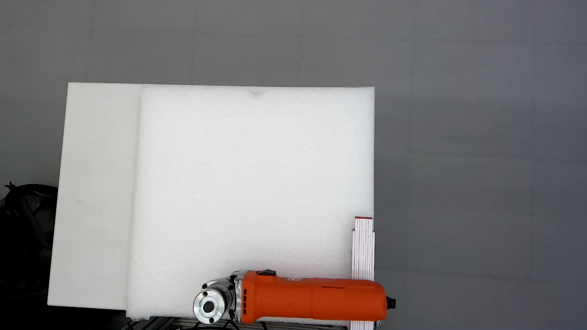
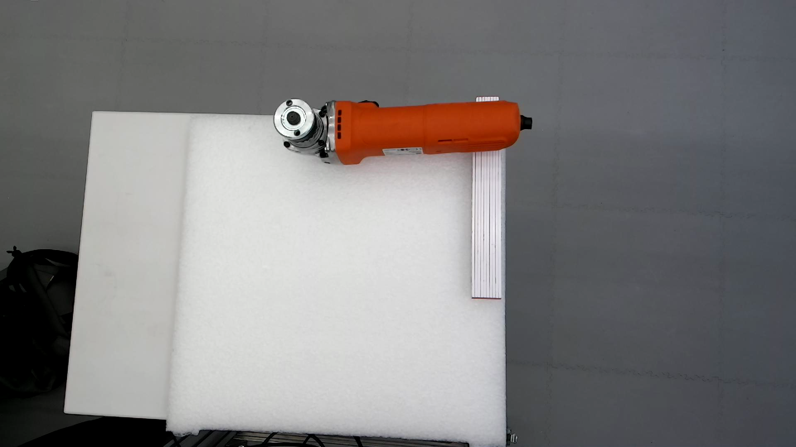
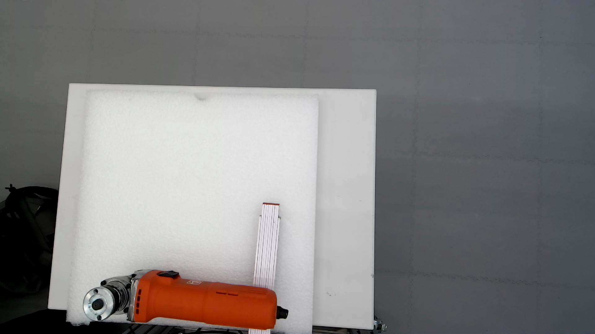
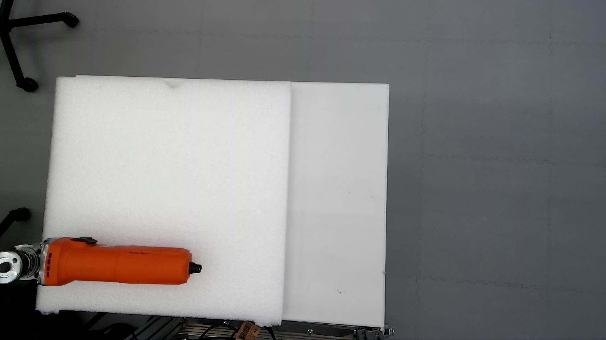
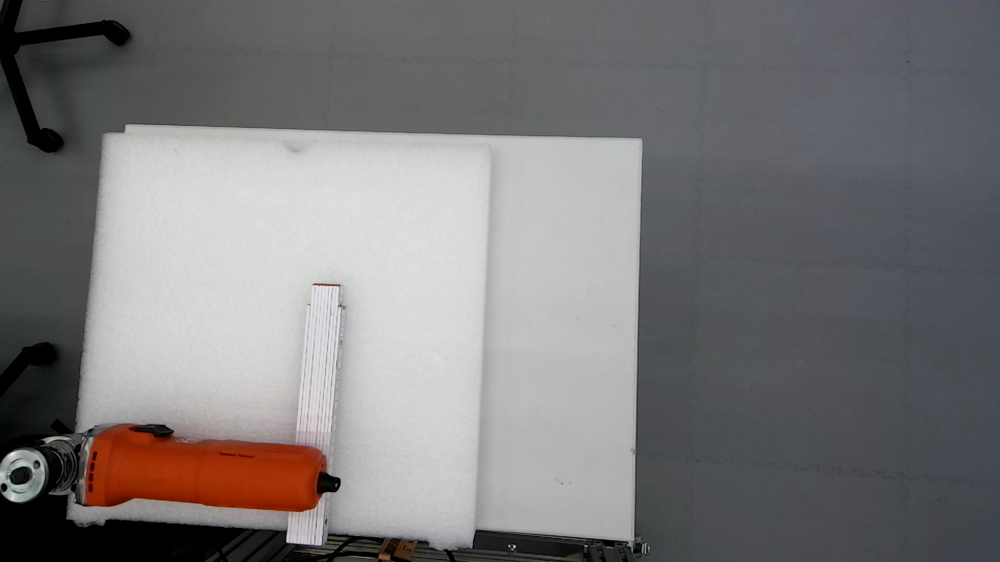
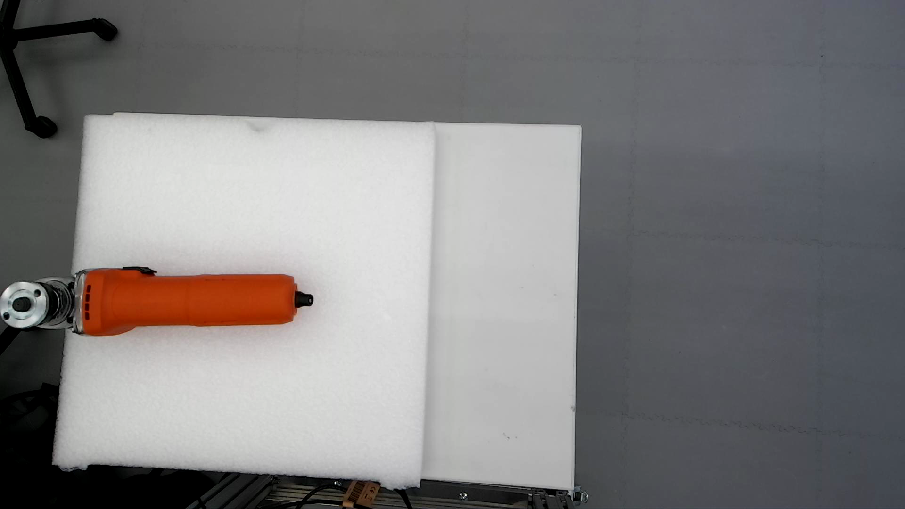
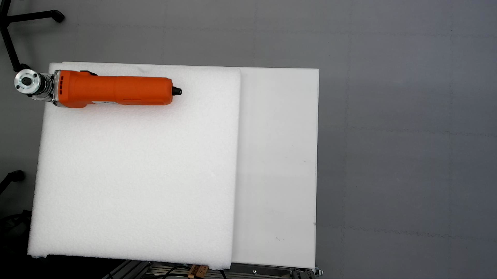

# Experiments 2026.05.13
## Test 1 variant of 2026.05.08
- Added a wedge under the angle grinder

|No.|Result|Description|Poses|Grasp|Log|Record|
|--|--|--|--|--|--|--|
|3|Failed|Gripper too close to the table. Grasp aborted.|[1-3](1-3_poses.ply)|[1-3](1-3_grasp.ply)|[1-3](1-3_log.md)|[1-3](1-3.mp4)|
|4|Failed|Gripper stuck in the foam. Grasp was loose.|[1-4](1-4_poses.ply)|[1-4](1-4_grasp.ply)|[1-4](1-4_log.md)|[1-4](1-4.mp4)|
|5|Skipped|

- Conclusion:
    - After adding the wedge, the quality of grasp did not show notable improvement.

## Test 3 variant of 2026.05.08
- Added a wedge under the angle grinder

|No.|Result|Description|Poses|Grasp|Log|Record|
|--|--|--|--|--|--|--|
|3|Failed|*Big deviation in placement|[3-3](3-3_poses.ply)|[3-3](3-3_grasp.ply)|[3-3](3-3_log.md)|[3-3](3-3.mp4)|
|4|Partially successful|Manual intervention|[3-4](3-4_poses.ply)|[3-4](3-4_grasp.ply)|[3-4](3-4_log.md)|[3-4](3-4.mp4)|
|5|Partially successful|Manual intervention|[3-5](3-5_poses.ply)|[3-5](3-5_grasp.ply)|[3-5](3-5_log.md)|[3-5](3-5.mp4)|
|6|Failed|Tool stuck on the gripper during placement|[3-6](3-6_poses.ply)|[3-6](3-6_grasp.ply)|[3-6](3-6_log.md)|[3-6](3-6.mp4)|
|7|Partially successful|Manual intervention|[3-7](3-7_poses.ply)|[3-7](3-7_grasp.ply)|[3-7](3-7_log.md)|[3-7](3-7.mp4)|

- Conclusion:
    - *The deviation was resulted from the point cloud of the wedge under the angle grinder. It caused a shift to the center of gravity.
    - *This deviation was compensated by filtering out the wedge's point cloud in later experiments.
    - After adding the wedge, Test3 variant partially succeeded 3/5
    - For successful placement, manual intervention was necessary.

## Test 4 variant of 2026.05.08
- Added a wedge under the angle grinder

|No.|Result|Description|Poses|Grasp|Log|Record|
|--|--|--|--|--|--|--|
|3|Failed|No poses generated|[4-3](4-3_no_pose.ply)||[4-3](4-3_log.md)||
|4|Failed|No poses generated|[4-4](4-4_no_pose.ply)||[4-4](4-4_log.md)||
|5|Skipped

- Conclusion:
    - Test4 variant stopped after 2 attempts due to no possible grasp poses

## Test 7

|No.|Result|Description|Poses|Grasp|Log|Record|
|--|--|--|--|--|--|--|
|1|Failed|No poses generated|[7-1](7-1_no_pose.ply)||[7-1](7-1_log.md)||
|2|Failed|No poses generated|[7-2](7-2_no_pose.ply)||[7-2](7-2_log.md)||
|3|Failed|No poses generated|[7-3](7-3_no_pose.ply)|
|4|Failed|No poses generated|[7-4](7-4_no_pose.ply)|
|5|Failed|No poses generated|[7-5](7-5_no_pose.ply)|

- Conclusion:
    - Test 7 failed 5/5
    - Noises in the point cloud affected the position of center of mass
    - The noise may be caused by the reflexion from the metal part of the angle grinder

### Test 7 variant
- Added a wedge under the angle grinder
 

|No.|Result|Description|Poses|Grasp|Log|Record|
|--|--|--|--|--|--|--|
|6|Failed|No poses generated|[7-6](7-6_no_pose.ply)|
|7|Failed|No poses generated|[7-7](7-7_no_pose.ply)|
|8|Failed|No poses generated|[7-8](7-8_no_pose.ply)|
|9|Skipped

- Conclusion:
    - Test 7 variant aborted after 3 attempts due to no valid grasps

## Test 8

|No.|Result|Description|Poses|Grasp|Log|Record|
|--|--|--|--|--|--|--|
|1|Failed|Gripper stuck in the foam|[8-1](8-1_poses.ply)|[8-1](8-1_grasp.ply)|[8-1](8-1_log.md)|[8-1](8-1.mp4)|
|2|Failed|No poses generated|[8-2](8-2_no_pose.ply)||[8-2](8-2_log.md)||
|3|Failed|No poses generated|[8-3](8-3_no_pose.ply)||||
|4|Partially succeeded|Manual intervention, noises in pcd|[8-4](8-4_poses.ply)|[8-4](8-4_grasp.ply)|[8-4](8-4_log.md)|[8-4](8-4.mp4)|
|5|Failed|Gripper stuck in the foam. Grasp too loose|[8-5](8-5_poses.ply)|[8-5](8-5_grasp.ply)|[8-5](8-5_log.md)|[8-5](8-5.mp4)|
|x|Succeeded|*Perfect pick-and-place, no manual intervention|Unfortunately the pcd was covered by another file|And cannot be retrieved|[8-x](8-x_log.md)|[8-x](8-x.mp4)|

- Conclusion:
    - Test 8 partially succeeded 1/5
    - The noise in the point cloud led to failure in generating grasp poses.
        - [?] One solution is to modify the way of calculating the center of mass by giving more weight to the point cloud (0.5xpcd+0.5xobb -> 0.7xpcd+0.3xobb)
    - *Note that in Test 8-x the pick-and-place was perfect. It took a bit luck to grasp the tool in a optimal pose so that it did not flip over.
        - [?] What about adding some additional weight to the end of the handle, which could 1. act as a wedge, 2. make the tool be grasped in an optimal position.

## Test 9

|No.|Result|Description|Poses|Grasp|Log|Record|
|--|--|--|--|--|--|--|
|1|Partially successful|Manual intervention|[9-1](9-1_poses.ply)|[9-1](9-1_grasp.ply)|[9-1](9-1_log.md)|[9-1](9-1.mp4)|
|2|Partially successful|Manual intervention|[9-2](9-2_poses.ply)|[9-2](9-2_grasp.ply)|[9-2](9-2_log.md)|[9-2](9-2.mp4)|
|3|Partially successful|Manual intervention|[9-3](9-3_poses.ply)|[9-3](9-3_grasp.ply)|[9-3](9-3_log.md)|[9-3](9-3.mp4)|
|4|Partially successful|Manual intervention|[9-4](9-4_poses.ply)|[9-4](9-4_grasp.ply)|[9-4](9-4_log.md)|[9-4](9-4.mp4)|
|5|Partially successful|Manual intervention|[9-5](9-5_poses.ply)|[9-5](9-5_grasp.ply)|[9-5](9-5_log.md)|[9-5](9-5.mp4)|

- Conclusion:
    - Test 9 partially succeeded 5/5.

