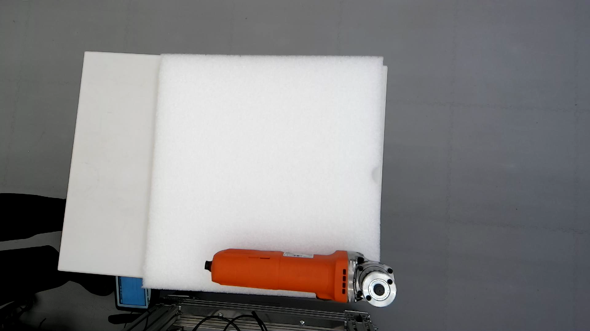
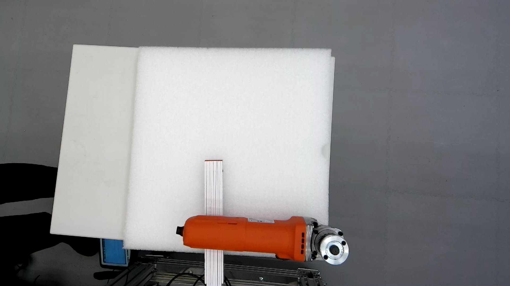
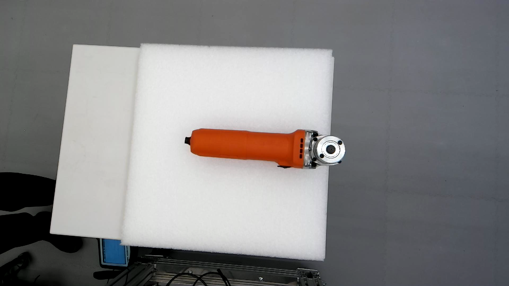
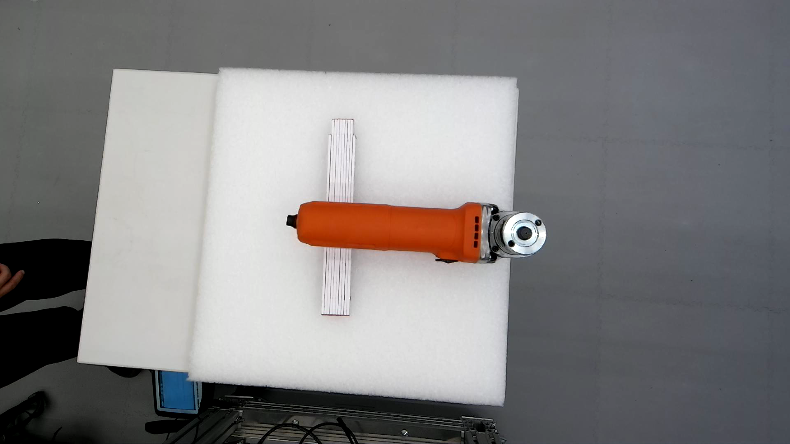
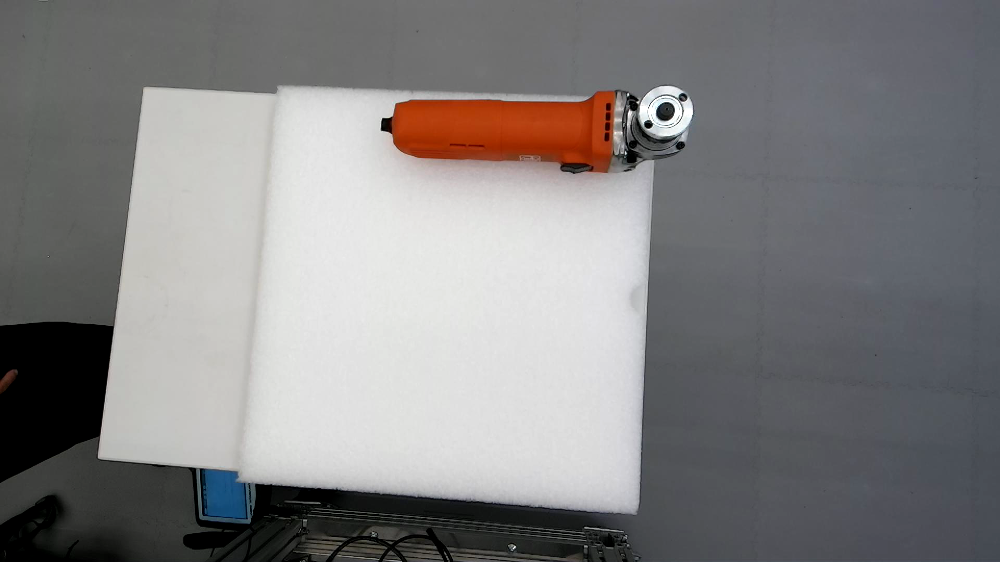

# Experiments 2026.05.15
## Test 10

|No.|Result|Description|Poses|Grasp|Log|Record|
|--|--|--|--|--|--|--|
|1|Failed|No poses generated.|[10-1](10-1_no_pose.ply)||[10-1](10-1_log.md)||
|2|Failed|No poses generated.|[10-2](10-2_no_pose.ply)||[10-2](10-2_log.md)||
||Skipped|

- Conclusion:
    - Test10 stopped after 2 attempts due to no possible grasp poses

### Test 10 variant 
- Added a wedge under the angle grinder

|No.|Result|Description|Poses|Grasp|Log|Record|
|--|--|--|--|--|--|--|
|3|Failed|No poses generated.|[10-3](10-3_no_pose.ply)||||
|4|Failed|No poses generated.|[10-4](10-4_no_pose.ply)||||
||Skipped|

- Conclusion:
    - Test10 variant stopped after 2 attempts due to no possible grasp poses

## Test 11

|No.|Result|Description|Poses|Grasp|Log|Record|
|--|--|--|--|--|--|--|
|1|Failed|No poses generated.|[11-1](11-1_no_pose.ply)||||
|2|Failed|No poses generated.|[11-2](11-2_no_pose.ply)||||
||Skipped|

- Conclusion:
    - Test11 stopped after 2 attempts due to no possible grasp poses

### Test 11 variant
- Added a wedge under the angle grinder

|No.|Result|Description|Poses|Grasp|Log|Record|
|--|--|--|--|--|--|--|
|3|Failed|No poses generated.|[11-3](11-3_no_pose.ply)||||
|4|Failed|No poses generated.|[11-4](11-4_no_pose.ply)||||
||Skipped|

- Conclusion:
    - Test11 variant stopped after 2 attempts due to no possible grasp poses

## Test 12

|No.|Result|Description|Poses|Grasp|Log|Record|
|--|--|--|--|--|--|--|
|1|Partially successful|Manual intervention|[12-1](12-1_poses.ply)|[12-1](12-1_grasp.ply)|[12-1](12-1_log.md)|[12-1](12-1.mp4)|
|2|Partially successful|Manual intervention|[12-2](12-2_poses.ply)|[12-2](12-2_grasp.ply)|[12-2](12-2_log.md)|[12-2](12-2.mp4)|
|3|Failed|Tool fell during placement|[12-3](12-3_poses.ply)|[12-3](12-3_grasp.ply)|[12-3](12-3_log.md)|[12-3](12-3.mp4)|
|4|Failed|Tool fell during placement|[12-4](12-4_poses.ply)|[12-4](12-4_grasp.ply)|[12-4](12-4_log.md)|[12-4](12-4.mp4)|
|5|Partially successful|Manual intervention|[12-5](12-5_poses.ply)|[12-5](12-5_grasp.ply)|[12-5](12-5_log.md)|[12-5](12-5.mp4)|

- Conclusion:
    - From Test 12 on a new parameter ``grasp_cog_min_dist_th`` was set (to -0.02 in this test), which limits the distance between the cog (center of gravity) and grasp center point.
        - Together with ``grasp_cog_dist_th`` (set to 0.04 in this test), these two parameters help limit the grasp point to be on the upper part of the angle grinder ("neck"), which could **hopefully** ensure a better grasp pose and placement success rate.
    - Test 12 partially succeeded 3/5
    - Notice the grasp poses generated in these tests always had a slight angle deviation to the center line of the angle grinder, which resulted in a deviation in placement. In 12-3 and 12-4 those deviation were too big that even manual intervention could not help adjust the tool to a proper placement position.
        - [?] Since the grasp point has been limited and the tool pose before placement would not vary much, maybe setting a hardcoded placement pose would help solve the issue.