# Experiments 2025.05.19
## Test 12 variant of 2026.05.15
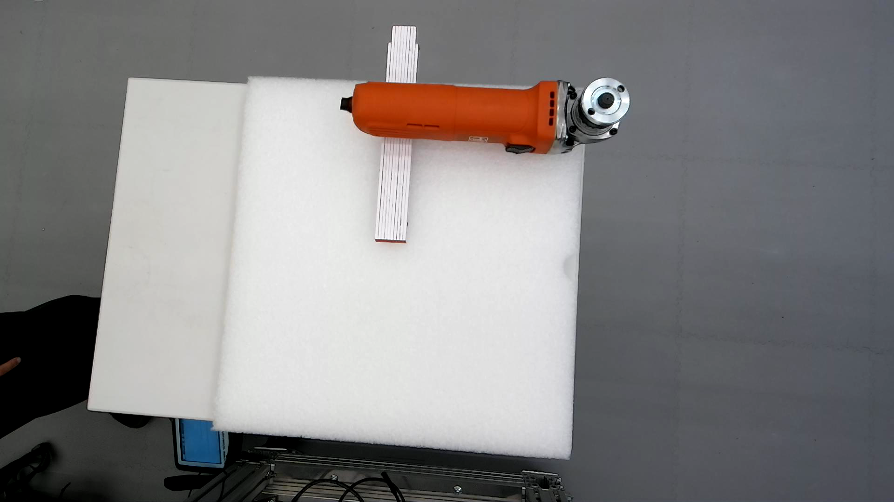

|No.|Result|Description|Poses|Grasp|Log|Record|
|--|--|--|--|--|--|--|
|5|Failed|Execution aborted during execution. The grasp was too loose.|[12-5](12-5_poses.ply)|[12-5](12-5_grasp.ply)|[12-5](12-5_log.md)|[12-5](12-5.mp4)|
|6|Partially successful|Manual intervention. Deviation in placement.|[12-6](12-6_poses.ply)|[12-6](12-6_grasp.ply)|[12-6](12-6_log.md)|[12-6](12-6.mp4)|
|7|Failed|Execution aborted during execution. The grasp was too loose.|[12-7](12-7_poses.ply)|[12-7](12-7_grasp.ply)|[12-7](12-7_log.md)|[12-7](12-7.mp4)|
|8|Failed|Tool fell during turning around|[12-8](12-8_poses.ply)|**[TODO 12-8]**(12-8_grasp.ply)|[12-8](12-8_log.md)|[12-8](12-8.mp4)|
||Skipped

- Conclusion:
    - Test12 variant aborted after two failed execution. Partially Succeeded 1/4.
    - The grasp pose always showed an angular offset around the longest axis (x-axis) of the angle grinder, which resulted in a loose grasp.
        - The angular offset was probably due to the distance between the base axis (the (0,0,0) in table frame) and the point cloud.

## Test 13
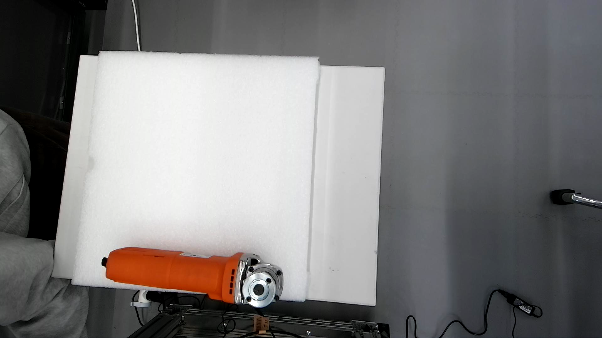

|No.|Result|Description|Poses|Grasp|Log|Record|
|--|--|--|--|--|--|--|
|1|Failed|No poses generated.|[13-1](13-1_no_pose.ply)||||
|2|Failed|No poses generated.|[13-2](13-2_no_pose.ply)||||
||Skipped|

- Conclusion:
    - Test13 stopped after 2 attempts due to no possible grasp poses

### Test 13 variant
- Added a wedge under the angle grinder
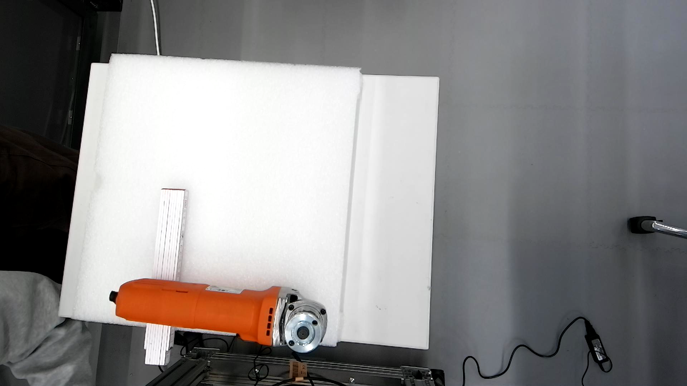

|No.|Result|Description|Poses|Grasp|Log|Record|
|--|--|--|--|--|--|--|
|3|Failed|No poses generated.|[13-3](13-3_no_pose.ply)||||
|4|Failed|No poses generated.|[13-4](13-4_no_pose.ply)||||
||Skipped|

- Conclusion:
    - Test13 variant stopped after 2 attempts due to no possible grasp poses

## Test 14
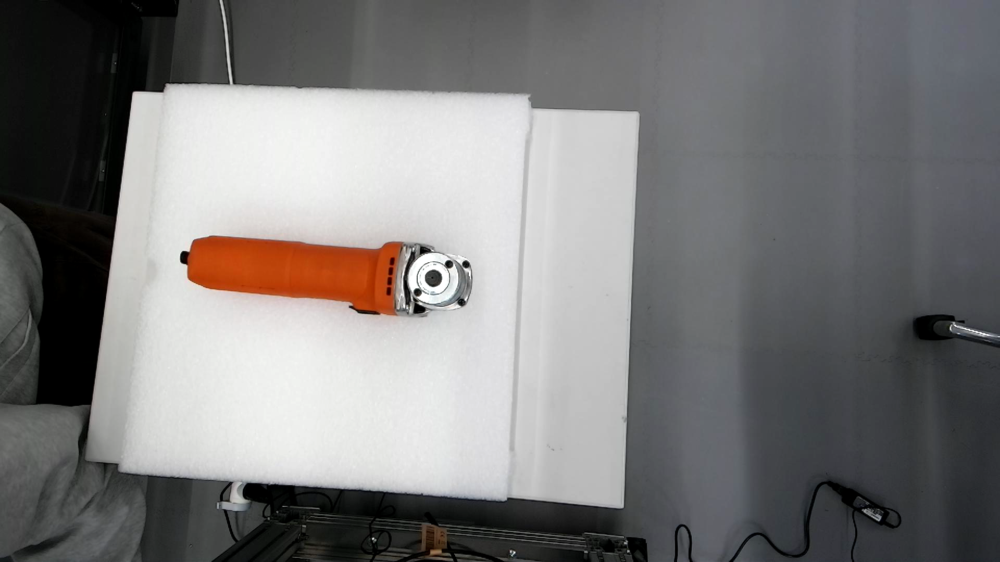

|No.|Result|Description|Poses|Grasp|Log|Record|
|--|--|--|--|--|--|--|
|1|Failed|No poses generated.|[14-1](14-1_no_pose.ply)||||
|2|Failed|No poses generated.|[14-2](14-2_no_pose.ply)||||
||Skipped|

- Conclusion:
    - Test14 stopped after 2 attempts due to no possible grasp poses

### Test 14 variant
- Added a wedge under the angle grinder
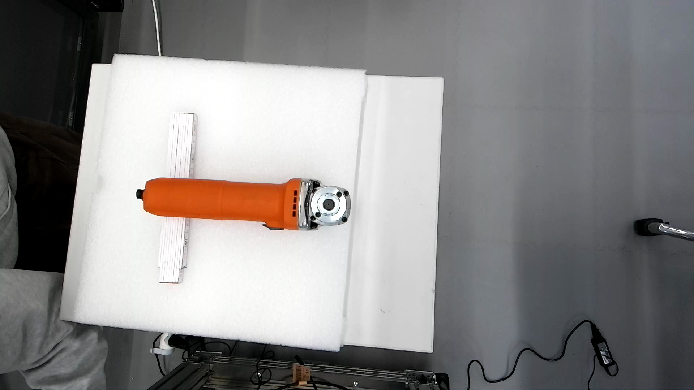

|No.|Result|Description|Poses|Grasp|Log|Record|
|--|--|--|--|--|--|--|
|3|Failed|No poses generated.|[14-3](14-3_no_pose.ply)||||
|4|Failed|No poses generated.|[14-4](14-4_no_pose.ply)||||
||Skipped|

- Conclusion:
    - Test14 variant stopped after 2 attempts due to no possible grasp poses

## Test 15
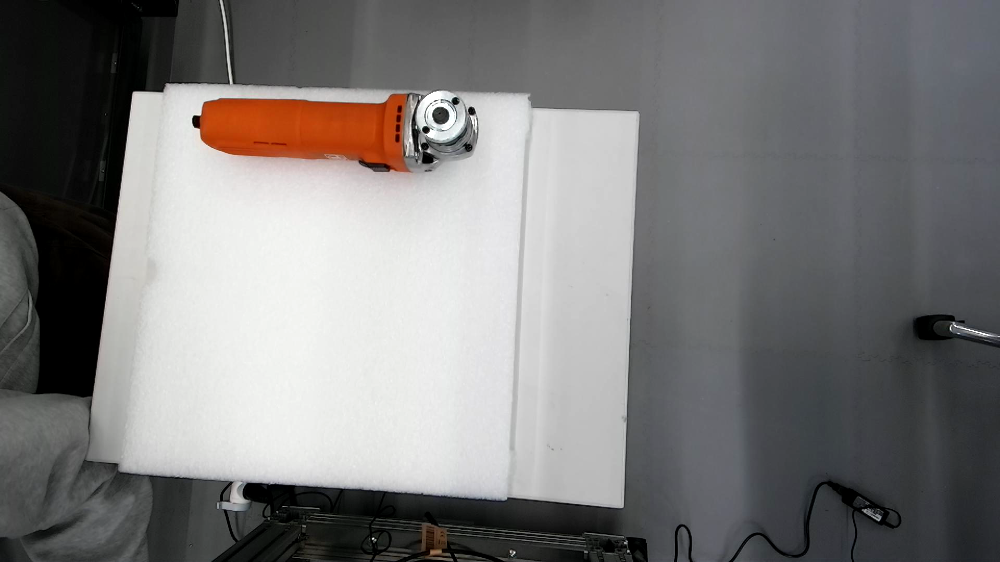

|No.|Result|Description|Poses|Grasp|Log|Record|
|--|--|--|--|--|--|--|
|1|Partially successful|Manual intervention|[15-1](15-1_poses.ply)|[15-1](15-1_grasp.ply)|[15-1](15-1_log.md)|[15-1](15-1.mp4)|
|2|Partially successful|Manual intervention|[15-2](15-2_poses.ply)|[15-2](15-2_grasp.ply)|[15-2](15-2_log.md)|[15-2](15-2.mp4)|
|3|Partially successful|Manual intervention|[15-3](15-3_poses.ply)|[15-3](15-3_grasp.ply)|[15-3](15-3_log.md)|[15-3](15-3.mp4)|
|4|Failed|Tool fell during placement|[15-4](15-4_poses.ply)|[15-4](15-4_grasp.ply)|[15-4](15-4_log.md)|[15-4](15-4.mp4)|
|5|Partially successful|Manual intervention|[15-5](15-5_poses.ply)|[15-5](15-5_grasp.ply)|[15-5](15-5_log.md)|[15-5](15-5.mp4)|

- Conclusion:
    - Test 15 Partially succeeded 4/5
    - Big deviation in placement due to angular offset of grasp pose and not optimal grasp contact point

### Test 15 variant
- Added a wedge under the angle grinder
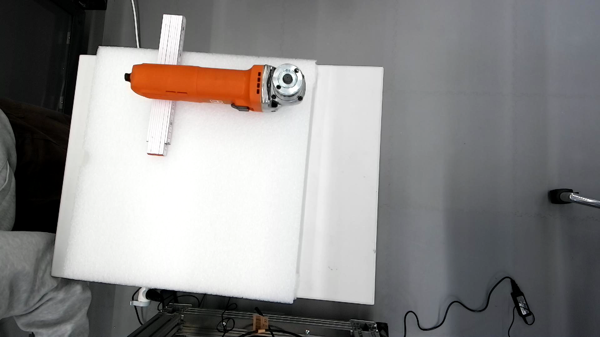

|No.|Result|Description|Poses|Grasp|Log|Record|
|--|--|--|--|--|--|--|
|6|Failed|Tool failed during grasp.|[15-6](15-6_poses.ply)|[15-6](15-6_grasp.ply)|[15-6](15-6_log.md)|[15-6](15-6.mp4)|
|7|Failed|Aborted. Grasp too loose.|[15-7](15-7_poses.ply)|[15-7](15-7_grasp.ply)|[15-7](15-7_log.md)|[15-7](15-7.mp4)|
||Skipped|

- Conclusion:
    - Test 15 variant aborted after 2 tests due to loose grasp.

## Test 16
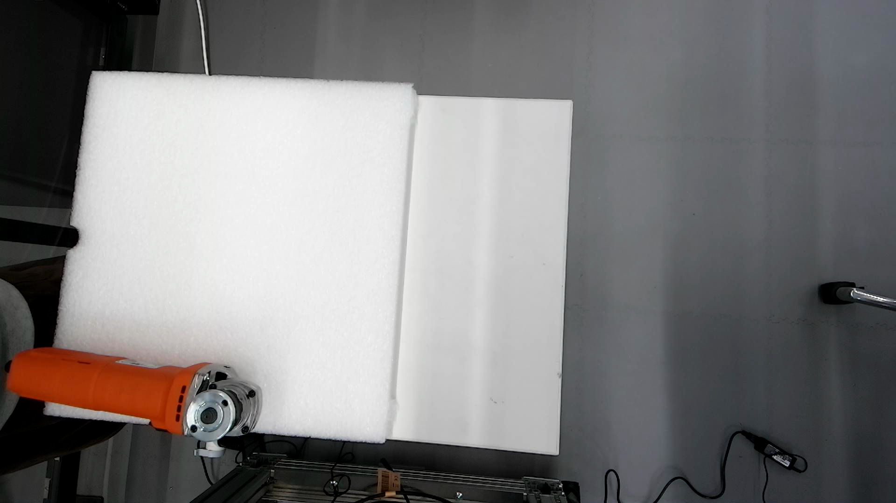

|No.|Result|Description|Poses|Grasp|Log|Record|
|--|--|--|--|--|--|--|
|1|Failed|No poses generated.|[16-1](16-1_no_pose.ply)||||
|2|Failed|No poses generated.|[16-2](16-2_no_pose.ply)||||
||Skipped|

- Conclusion:
    - Test16 stopped after 2 attempts due to no possible grasp poses

### Test 16 variant
- Added a wedge under the angle grinder
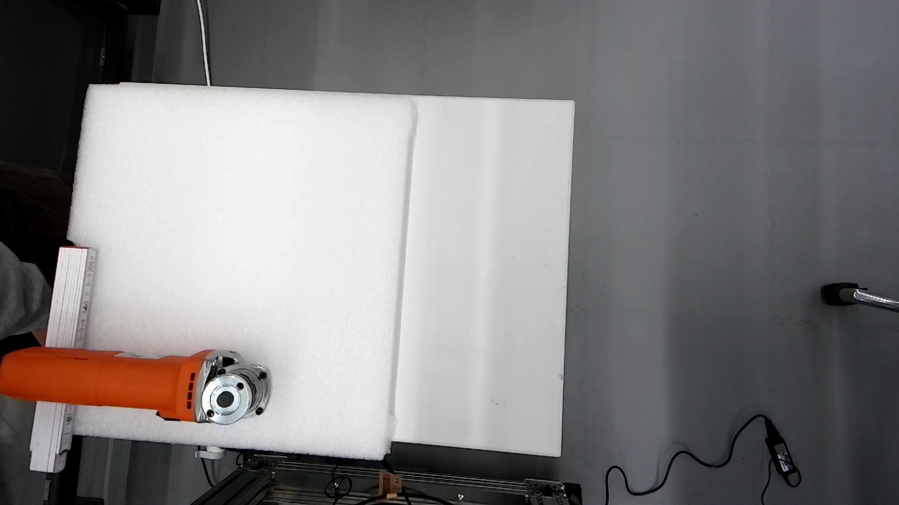

|No.|Result|Description|Poses|Grasp|Log|Record|
|--|--|--|--|--|--|--|
|3|Partially succeeded|Manual intervention.|[16-3](16-3_poses.ply)|[16-3](16-3_grasp.ply)|[16-3](16-3_log.md)|[16-3](16-3.mp4)|
|4|Failed|No poses generated.|[16-4](16-4_no_pose.ply)||||
|5|Failed|No poses generated.|[16-5](16-5_no_pose.ply)||||
||Skipped|

- Conclusion:
    - Test16 variant partially succeeded 1/3.
    - Test16 variant stopped after 2 attempts due to no possible grasp poses.

## Test 17
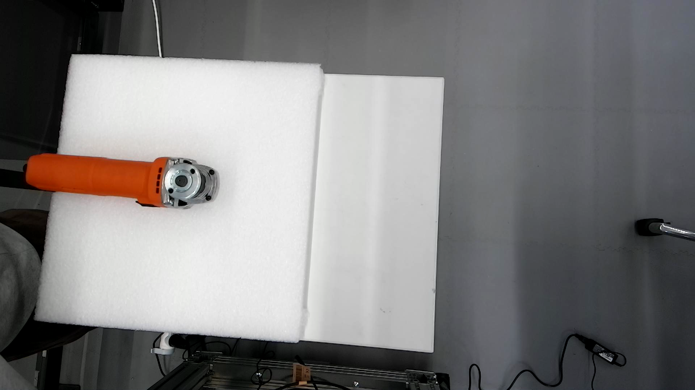

|No.|Result|Description|Poses|Grasp|Log|Record|
|--|--|--|--|--|--|--|
|1|Failed|No poses generated.|[17-1](17-1_no_pose.ply)||||
|2|Failed|No poses generated.|[17-2](17-2_no_pose.ply)||||
||Skipped|

- Conclusion:
    - Test17 stopped after 2 attempts due to no possible grasp poses

### Test 17 variant
- Added a wedge under the angle grinder
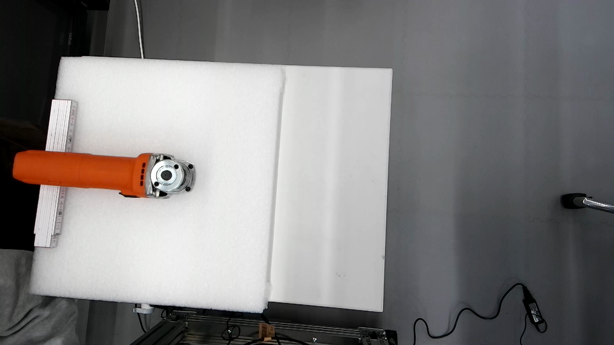

|No.|Result|Description|Poses|Grasp|Log|Record|
|--|--|--|--|--|--|--|
|3|Failed|No poses generated.|[17-3](17-3_no_pose.ply)||||
|4|Failed|No poses generated.|[17-4](17-4_no_pose.ply)||||
|5|Failed|No poses generated.|[17-5](17-5_no_pose.ply)||||
||Skipped|

- Conclusion:
    - Test17 variant stopped after 3 attempts due to no possible grasp poses

## Test 18
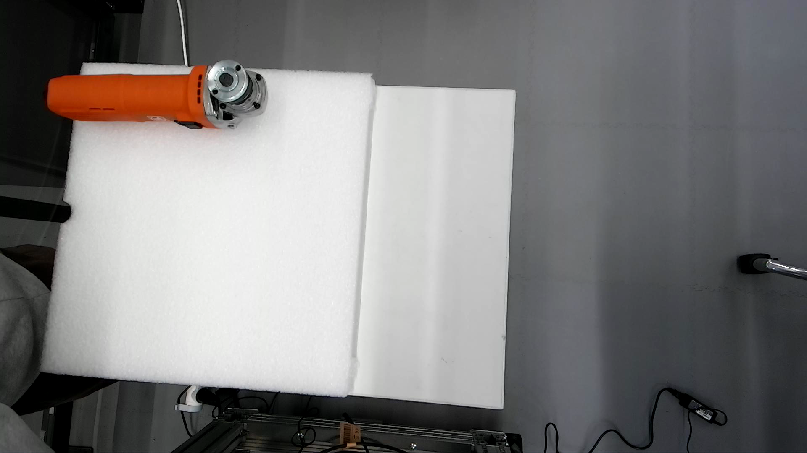

|No.|Result|Description|Poses|Grasp|Log|Record|
|--|--|--|--|--|--|--|
|1|Partially successful|Manual intervention|[18-1](18-1_poses.ply)|[18-1](18-1_grasp.ply)|[18-1](18-1_log.md)|[18-1](18-1.mp4)|
|2|Partially successful|Manual intervention|[18-2](18-2_poses.ply)|[18-2](18-2_grasp.ply)|[18-2](18-2_log.md)|[18-2](18-2.mp4)|
|3|Partially successful|Manual intervention|[18-3](18-3_poses.ply)|[18-3](18-3_grasp.ply)|[18-3](18-3_log.md)|[18-3](18-3.mp4)|
|4|Partially successful|Manual intervention|[18-4](18-4_poses.ply)|[18-4](18-4_grasp.ply)|[18-4](18-4_log.md)|[18-4](18-4.mp4)|
|5|Partially successful|Manual intervention|[18-5](18-5_poses.ply)|[18-5](18-5_grasp.ply)|[18-5](18-5_log.md)|[18-5](18-5.mp4)|

- Conclusion:
    - Test18 partially succeeded 5/5
    - Similar phenomenon to Test 12 & 15: Deviation in placement

### Test 18 variant
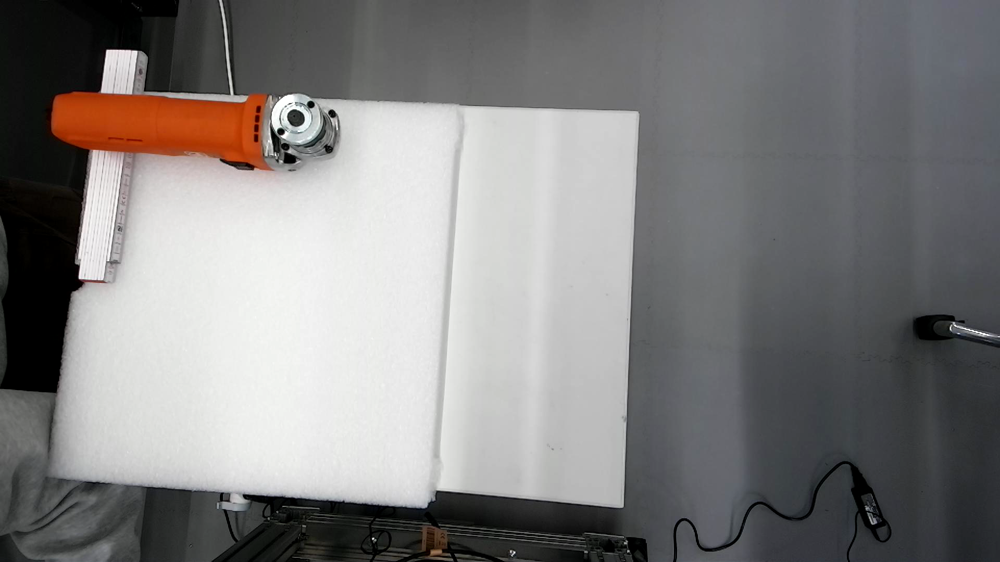

|No.|Result|Description|Poses|Grasp|Log|Record|
|--|--|--|--|--|--|--|
|6|Partially successful|Manual intervention|[18-6](18-6_poses.ply)|[18-6](18-6_grasp.ply)|[18-6](18-6_log.md)|[18-6](18-6.mp4)|
|7|Partially successful|Manual intervention|[18-7](18-7_poses.ply)|[18-7](18-7_grasp.ply)|[18-7](18-7_log.md)|[18-7](18-7.mp4)|
|8|Partially successful|Manual intervention|[18-8](18-8_poses.ply)|[18-8](18-8_grasp.ply)|[18-8](18-8_log.md)|[18-8](18-8.mp4)|
|9|Partially successful|Manual intervention|[18-9](18-9_poses.ply)|[18-9](18-9_grasp.ply)|[18-9](18-9_log.md)|[18-9](18-9.mp4)|
|10|Partially successful|Manual intervention|[18-10](18-10_poses.ply)|[18-10](18-10_grasp.ply)|[18-10](18-10_log.md)|[18-10](18-10.mp4)|

- Conclusion:
    - Test18 variant partially succeeded 5/5
    - Similar phenomenon to Test 12 & 15 & 18: Deviation in placement