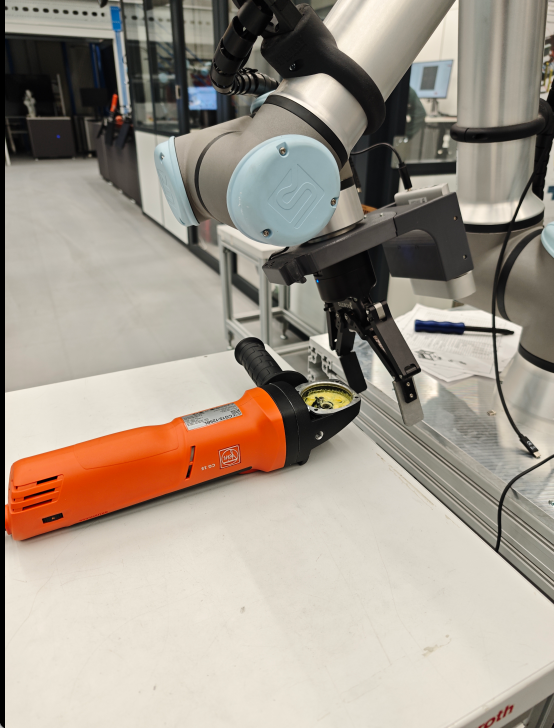
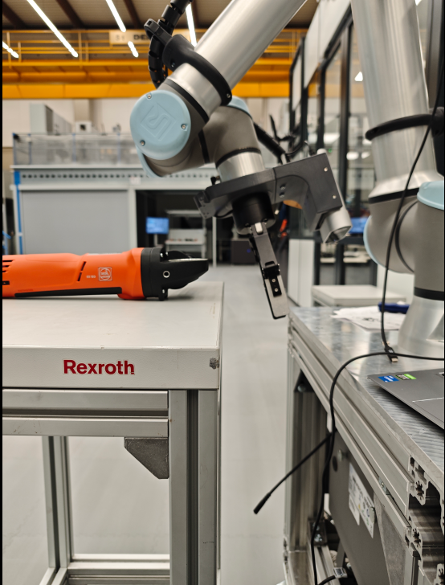
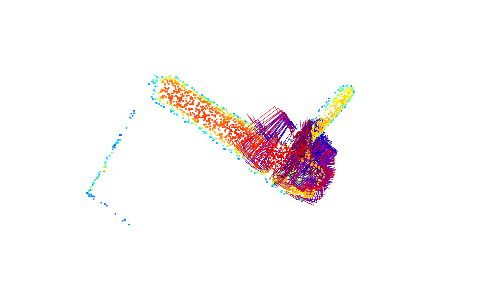
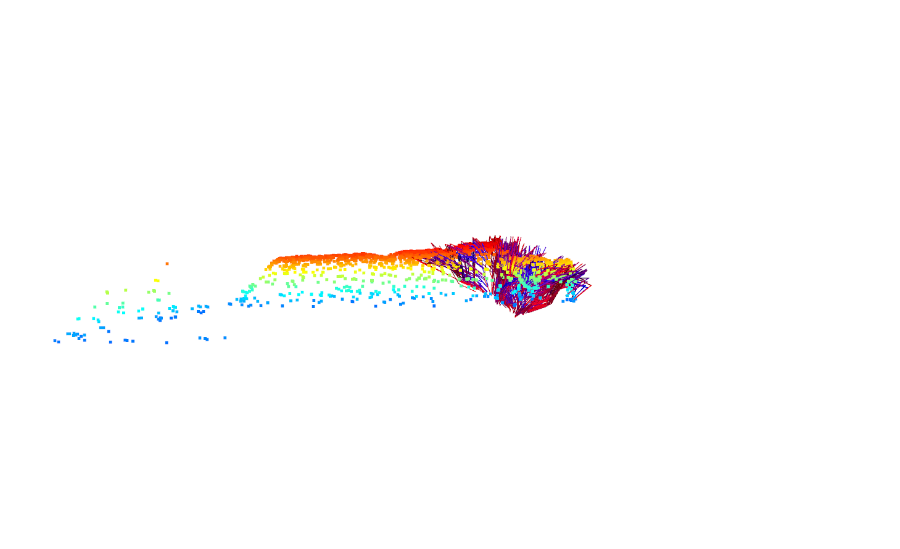
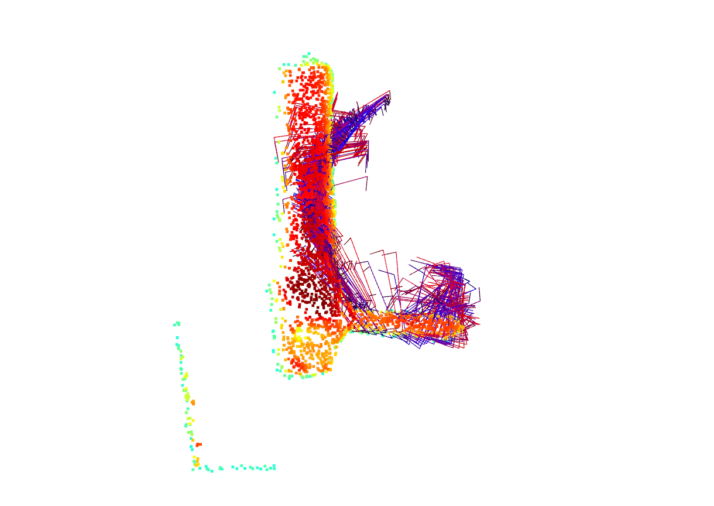
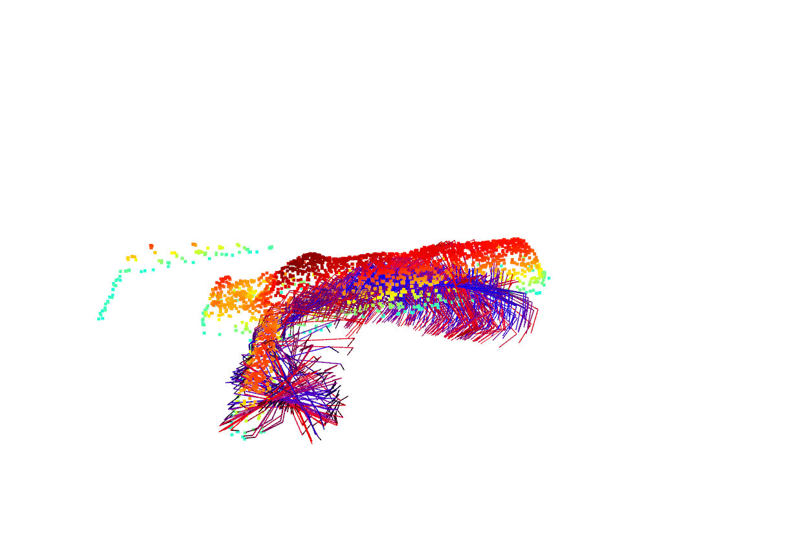
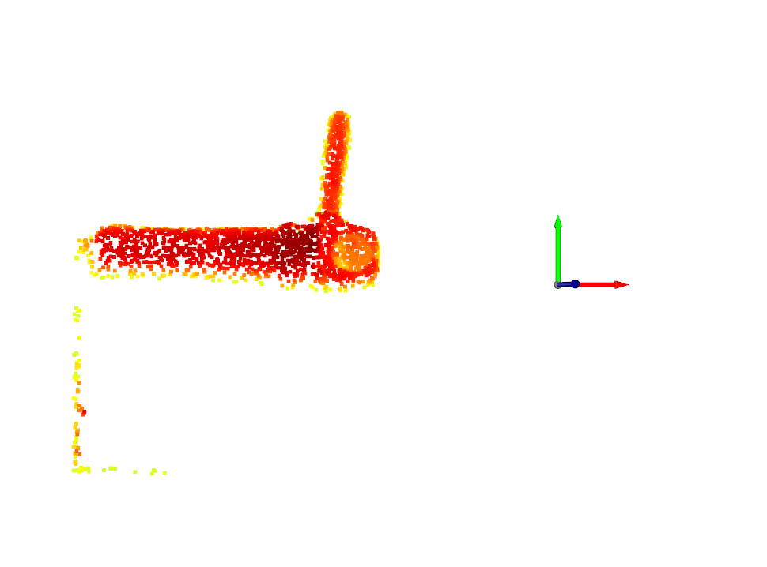
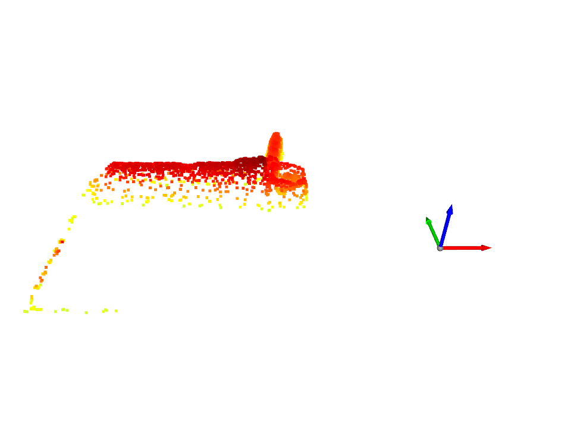
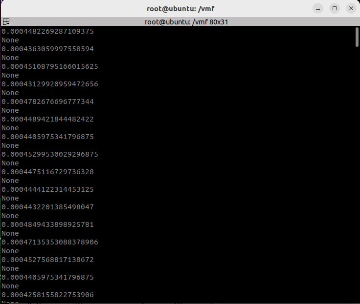
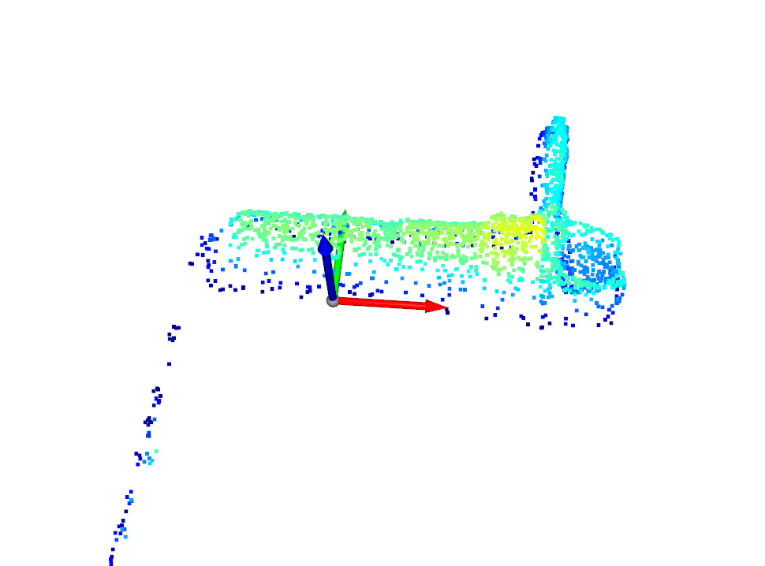

# Issues
## 11.03.2026 Biweekly Meetup
### 1. The gripper went to a deeper z-position, which then led to the crash with the desk and thus an emergency stop.
- The pose was given by the vMF-Algorithm.
- **Example 1** ``pcd 9274 th=0.8 w/o bounds``.
- Notice that I moved the table a bit so that they did not really crash, but as can be seen from the pictures, the gripper finger was already lower than the table plane. 

- Is the offset due to a bigger gripper we use in the setup? Any solution to offset the gripper a bit in approach direction?
---
### 2. The chosen pose was not always ideal and usable, even if it was the same object in different position.
- **Example 2** ``pcd 6177 th=0.9 without bounds``
    - The inference above took ~300s
    - Results focused on top of the angle grinder

    
- **Example 3** ``pcd 6072 th=0.9 without bounds``
    - The inference above took ~100s
    - Compared to example 2, I just rotated the angle grinder for 90°. However the result is much worse than before.

    
### 3. Pointcloud without center shift delievered better results
- The pose is based on the link "base_link", not an extra link e.g. "pcd_center" , because the shift of the coordination axis of the pointcloud will require extra effort in caliberation, while the result would not be any better.
- **Example 4** Pointcloud without center shift ``pcd 6072 th = 0.8 w/o bounds``
    - Result: Inference success
    - The inference above took ~300s

        
- **Example 5** Same pointcloud, but with center shift ``pcd 6072 th = 0.0 w/ bounds``
    - Result: Inference failed.
    - There was even no estimated pose for the point cloud after shifting when the threshold was set to 0.0

         

### 4. The inference time varied from 80s to more than 300s. The system would not be usable with such a long processing time.

