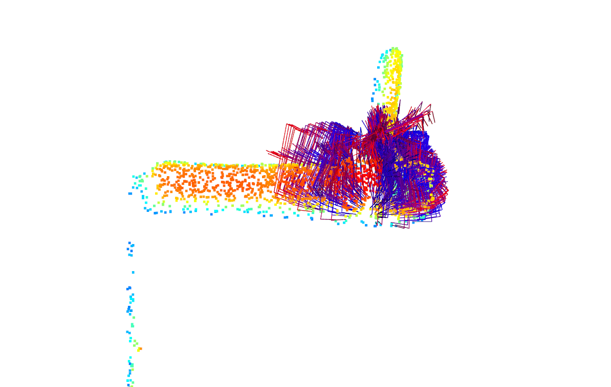
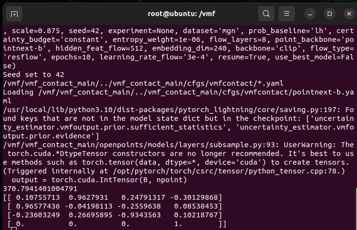
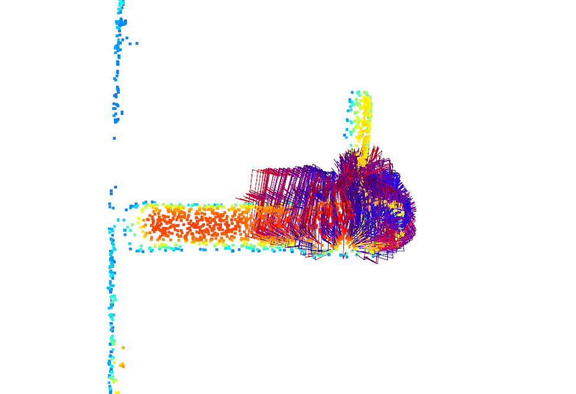
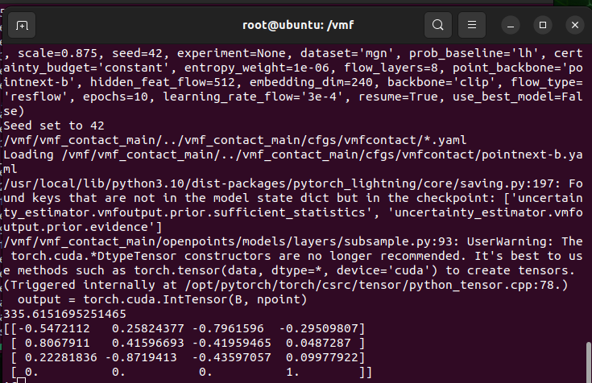

# Issues
## 11.03.2026 Biweekly Meetup
1. The gripper went to a deeper z-position, which then led to the crash with the desk and thus an emergency stop.
- The pose was given by the vMF-Algorithm.
- **TODO** example here pcd 9274 th=0.8 w/o bounds. **Photos from different perspectives or show this position in real**
- Due to the bigger gripper? Any solution to shift the gripper a bit in approach direction?

2. The chosen pose was not always ideal and usable, even if it was the same object in different position.
- e.g. here pcd 6177 th=0.9 without bounds

    - The inference above took ~300s
    - Results focused on top of the angle grinder
- e.g. here pcd 6072 th=0.9 without bounds

    - The inference above took ~100s
    - Even if the threshold was set to 0.9, the result still fell outside of the item.
- Other results
    - a. Pointcloud without center shift delievered better results
    - The pose is based on the link "base_link", not an extra link e.g. "pcd_center" , because the shift of the coordination axis of the pointcloud will require extra effort in caliberation but at the same time the result would not be any better.
    - e.g. here pcd 6072 th = 0.8 w/o bounds vs th = 0.0 w/ bounds
    
    
    
        - The inference above took ~300s
    
    
        - There was even no estimated pose for the point cloud after shifting when the threshold was set to 0.0 
    - b. Resolution of the point cloud not high enough?
    - e.g. Here snap a new pcd for front high th = 0.8 w/o bounds with 2400000 points and compare with the previous pcd with 40000 points.
        - Example 1
        - pcd (240000,3)
        - process time ~370s
    
    
        - Example 2
        - pcd (40000, 3)
        - process time ~335s
    
    
        - As can be seen from the screenshots, there were no major difference of the estimated pose positions. The chosen poses were slightly different.

3. The inference time varied between 80s to more than 300s. The system would not be usable with such a long processing time.

